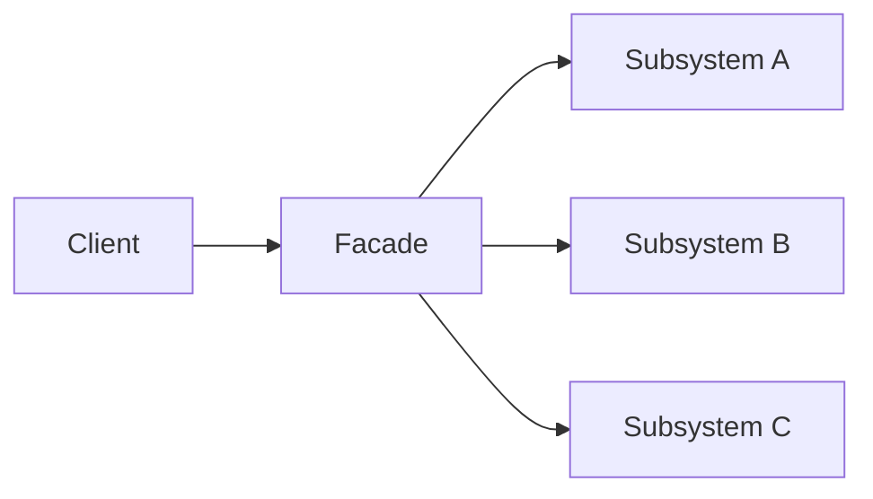
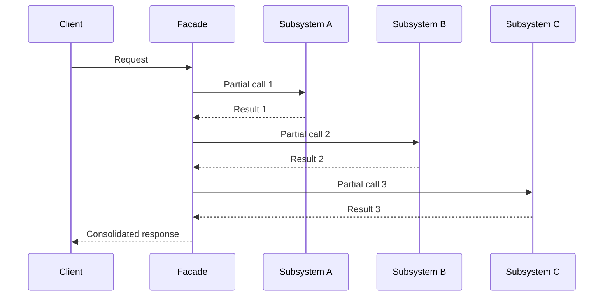

# Design Pattern

Concise, visual, and practical explanations of software design patterns for architecture, prototyping, and implementation.

The goal is to explain recurring design solutions in a way that is easy to understand, architecturally useful, and directly relevant for software development and prototyping. Each pattern should be described with a clear intent, a minimal diagram, and a short explanation of its internal logic. The focus is on correct, trustfull design pattern supporting a clear understanding of the parttern goals, structure, and practical relevance.

A design pattern is a proven, reusable solution to a recurring design problem in software. It does not prescribe one fixed implementation. Instead, it provides a structured way to think about responsibilities, interactions, and trade-offs in a system.

## Facade Pattern

The [*Facade Pattern*](https://rock-the-prototype.com/programmieren-lernen/facade-pattern/) provides a simple and stable entry point to a more complex internal subsystem. It reduces the amount of internal knowledge a client needs in order to use a set of related components. This makes external usage easier, while internal structure and orchestration can remain hidden behind the facade.

- The client interacts with one clear entry point instead of multiple internal components.
- The facade delegates requests to the relevant subsystems behind the scenes.
- This reduces outward complexity and stabilizes the external interface.
- The internal structure may change without forcing every client to change with it.

This sequence diagram shows how the Facade Pattern handles a client request through one central entry point. 
- The client sends a single request to the facade, which then coordinates several internal subsystem calls in the required order. 
- Each subsystem returns its partial result to the facade instead of responding directly to the client. 
- The facade combines these internal results and returns one consolidated response, hiding the underlying complexity from the client.

You may use this content alongside the Creative Commons Attribution 4.0 International (CC BY 4.0)

You can check the license along with this work, see [Creative Commons Attribution 4.0 International (CC BY 4.0)](https://creativecommons.org/licenses/by/4.0/)

© 2026 Sascha Block / Rock the Prototype
